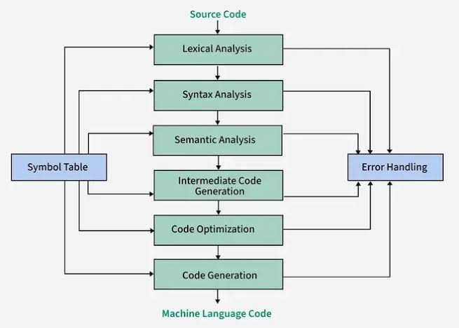

2. The "Elite" Design ChoicesThis is where you decide if your language is a toy or an industry-standard tool. You have to make some strict philosophical choices about how variables behave:Choice A: Static vs. Dynamic TypingDynamic (like Python/JS): let x = 5; x = "hello";. Easy for beginners, but terrible for performance and large codebases. The compiler doesn't know what x is until the program runs.Static (like C++/Java): int x = 5;. Fast and safe, but typing is tedious.The Ultimate Middle Ground (Type Inference): Like Rust or Swift. The user types let x = 5;, and your compiler automatically locks it in as an integer behind the scenes. You get the speed of C++ with the ease of Python.Choice B: Mutability (To change or not to change)If variables can change whenever they want, programs get messy and multi-threading becomes a nightmare. Modern "elite" languages make variables immutable by default.let data = 10; (Cannot be changed later)let mut data = 10; (The user must explicitly declare that this variable is allowed to change).Choice C: Null SafetyDo not implement null. The creator of the null reference famously called it his "billion-dollar mistake" because it causes so many crashes. Instead, use an Option or Maybe type (like Rust's Option<T>). It forces the programmer to handle the scenario where a variable might be empty before the code compiles.3. How the Compiler Actually Stores ThemWhen a user writes let x = 10; in your language, how does your Rust-based compiler remember it? It uses something called a Symbol Table.A Symbol Table is essentially a giant HashMap<String, VariableInfo> inside your compiler.The user types let age: i32 = 25;Your parser sees this and inserts a record into the Symbol Table: { name: "age", type: "i32", scope_level: 1, memory_address: 0x... }.Later in the code, when the user writes age + 5, your compiler looks up "age" in the Symbol Table to verify that it is an integer and is allowed to do math.

1. The Core Primitives (CPU-Bound)These are the ultra-fast building blocks that live directly on the CPU stack.CategoryTypesUse Case & Compiler BehaviorIntegersi8, i16, i32, i64, isizeStandard math. The compiler uses standard ALU (Arithmetic Logic Unit) instructions.Unsignedu8, u16, u32, u64, usizeMemory addressing and strict positive numbers.Floatsf32, f64Precision math. Handled by the CPU's Floating Point Unit (FPU).LogicboolTrue/False. Packed into single bits where possible to save memory.TextcharUnicode scalar values.2. The AI & Hardware Types (GPU/SIMD-Bound)General-purpose languages fail at AI because they don't natively understand parallel processing. Your language will.CategoryTypesUse Case & Compiler BehaviorAI Floatsbf16, fp8"Brain Floats" optimized specifically for Neural Network weights.VectorsVec2, Vec3, Vec4Game engine math. The compiler automatically uses SIMD (Single Instruction, Multiple Data) CPU instructions to process them all at once.TensorsTensor1D, Tensor2D, Tensor3DMassive data grids. The compiler natively routes these memory allocations directly to VRAM (GPU Memory).3. The Security Types (Memory-Safe)Standard strings are dangerous for cryptography. Your language treats security as a fundamental data type.CategoryTypesUse Case & Compiler BehaviorSecure MemorySecret<T>The compiler guarantees this memory is overwritten with zeros the exact microsecond the variable is no longer needed.Constant TimeCryptoBytesFixed-length arrays where the compiler ensures reading/writing always takes the exact same number of CPU cycles (preventing timing attacks).Massive MathBigIntNumbers that can grow to thousands of digits for RSA/Cryptography calculations.4. The Cloud & Web Types (Concurrency & Network)Modern apps don't just compute; they communicate.CategoryTypesUse Case & Compiler BehaviorAsync FlowChannel<T>, Stream<T>Thread-safe pipelines. The compiler's Borrow Checker ensures two threads cannot corrupt the data passing through.Data FormatsJSON, XMLNatively parsed data structures, turning API responses into compiler-checked objects instantly.StateSignal<T>Reactive variables for UI/Web development. When a Signal changes, the compiler knows exactly which parts of the program need to update.5. Collections & Composites (Heap-Bound)How users group data together.CategoryTypesUse Case & Compiler BehaviorGroupingstruct, classDefining custom data structures.VariantsenumAlgebraic Data Types. A variable can be this OR that.SafetyOption<T>, Result<T, E>The replacement for null. Forces the programmer to handle errors and missing data at compile time.ListsArray (Fixed), List (Growable), MapStandard data collections.How to Not Overwhelm the UserIf a beginner wants to write "Hello World" or a simple script, they shouldn't need to know what a Tensor3D or a CryptoBytes is.You solve this by building a powerful Type Inference Engine into your compiler's Semantic Analysis phase.Beginner Code (What they write):let speed = 100;
let message = "Hello";
The Compiler (What it does silently):Sees 100 -> Assigns i32 (Fast integer).Sees "Hello" -> Assigns standard string.Pro Code (When they need control):let weights: Tensor3D = GPU.alloc();
let password: Secret<String> = get_input();
The user only types the complex names when they specifically need that hardware or security behavior.

